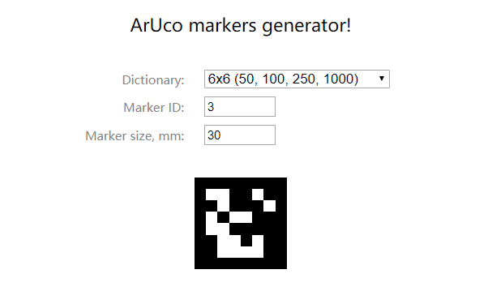

# 使用Opencv开发显微镜缩放功能
## 使用步骤
1. **配置环境** : python3
2. **安装外部库** :  在该目录下pip install -r [requirements.txt](requirements.txt)
3. **合并标本图片**: [Joint.py](Joint.py) 是将最高层级的图合并为一张图片的code， 如可以将最精细的40倍图片合并为一张很大的标本图像， 这也是我们后面所用到的图片， 我这里已经合成好了三张图片放到JointPhoto中，若需要添加新的图片则直接用这个代码来合成，每个子图像的命名还是按照"0x1"的格式来命名
4. **运行显微镜程序** : 运行 [MicroScope.py](MicroScope.py), 将对应mark放入摄像头内， 当mark放到合适的位置按下键盘'='键可以确认使用该mark, 然后通过对应键(看注释)进行放缩。当需要更换标本时，按下键盘'q'键 退出当前标本， 然后选择新的mark放入合适位置进行确认， 这里提供的mark图片放入到[MarkPhoto](MarkPhoto)中可进行下载使用，当然如果添加新的标本也可以自己生成mark， 网站为： http://chev.me/arucogen/ ， 其中Marker ID为你要填写的标本id， 其他各格式如图

5. 如果有什么问题可以去 https://github.com/BryceQing/MicroScope 提问 (如果感觉还可以的话给个星 Coding不容易)

# Demo video
[AR microscope demo](https://youtu.be/kBULYRY4Itw)
